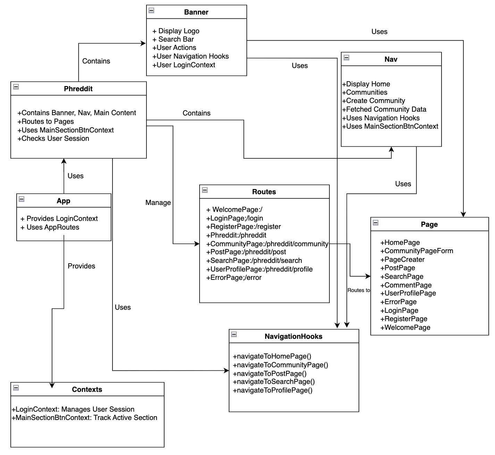
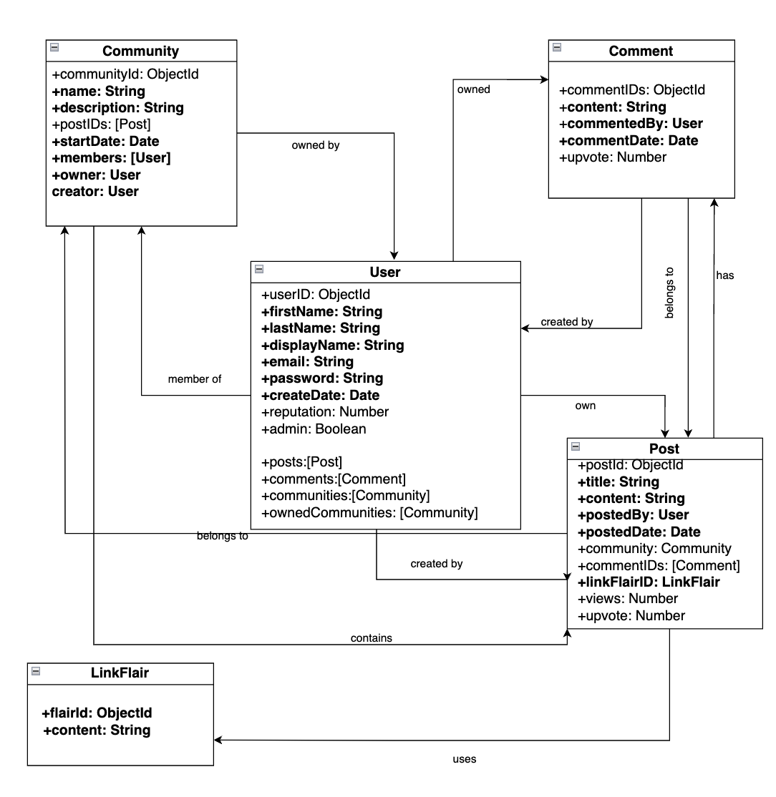
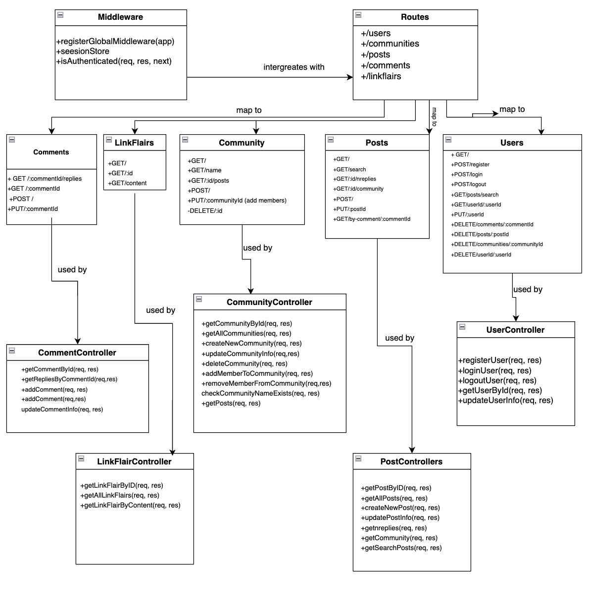

# Term Project

## Instructions to setup and run project

### Before running our code
- install mongodb at `https://www.mongodb.com/docs/manual/administration/install-on-linux/#std-label-install-mdb-community-edition-linux`
- Navigate to `server` and `client` directory and run npm install
- Run `npm install mongoose` if havent install yet

### When ready and wanted to run our code

- Open 4 terminal

- On the first terminal navigate to `server` directory and run `node init.js zoiye@gmail.com HoiFung do_work! true` to initialize the database

- On the second terminal navigate to `server` directory and run `node server.js` to run the run the server side on `localbost: 8000`

- On the third terminal navigate to `client` directory and run `npm start` to run the client side on `localhost: 3000`

- On the fourth one run `mongosh`

### To run unit test

- Navigate to `client` or `server` directory and run `npm test`

Go to http://localhost:3000 to see the project.

### Name of our database

- `phreddit` is the database that store communities, posts, linkflairs, users, comments, etc data for our server
- `session` is the database that store the session data.
